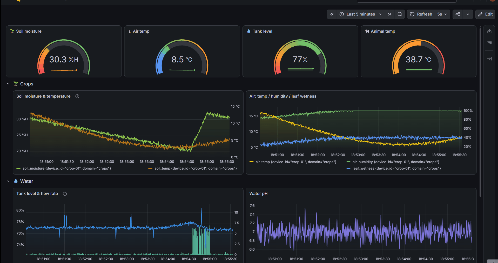
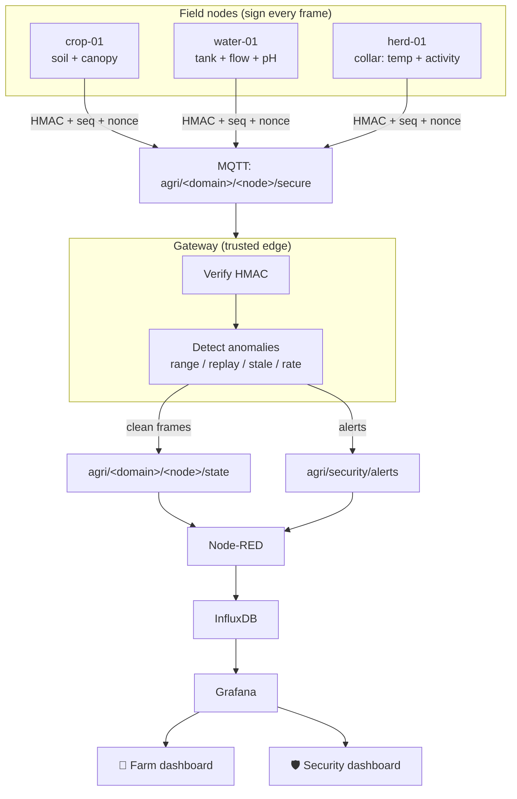
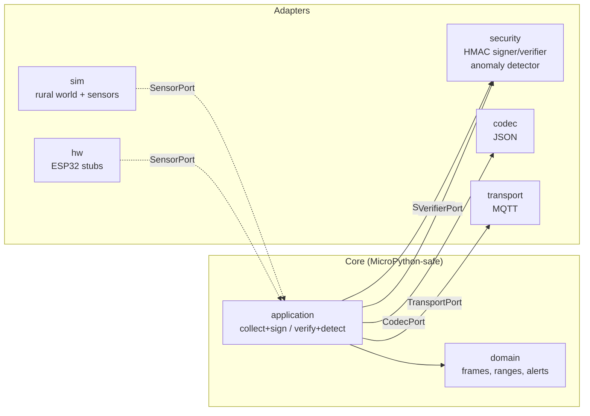
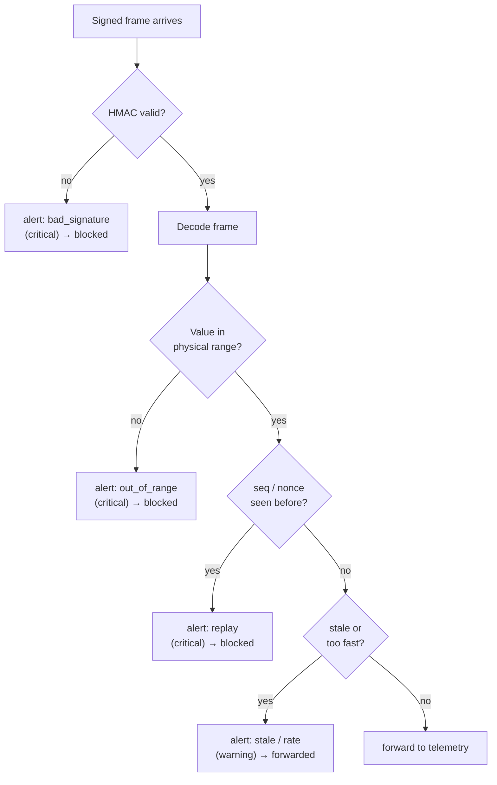
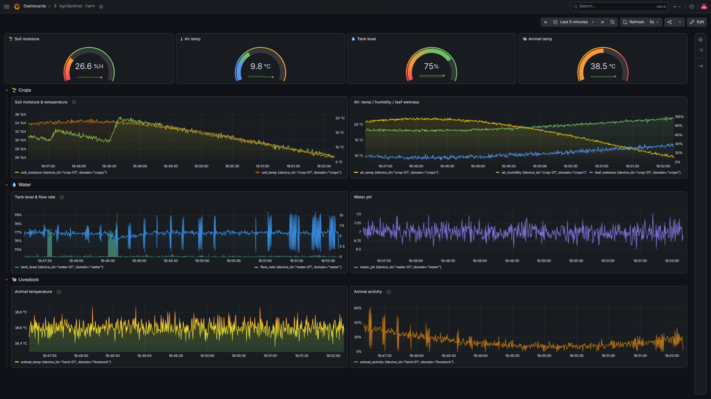
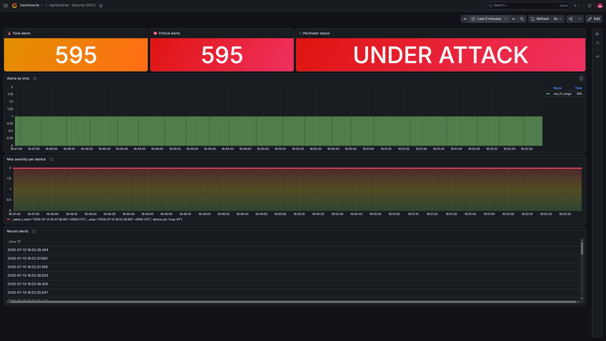
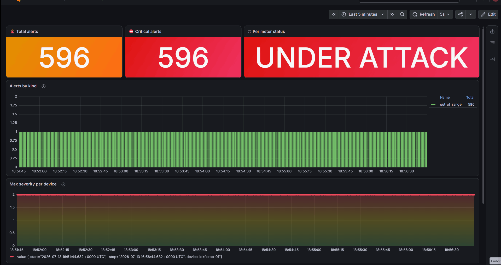
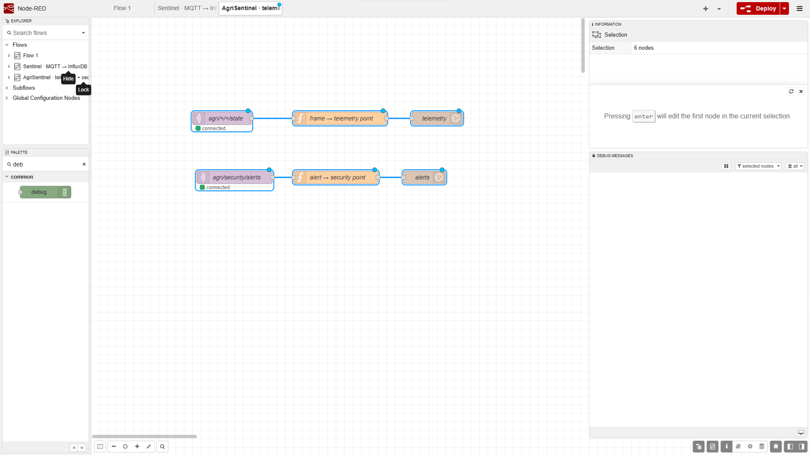
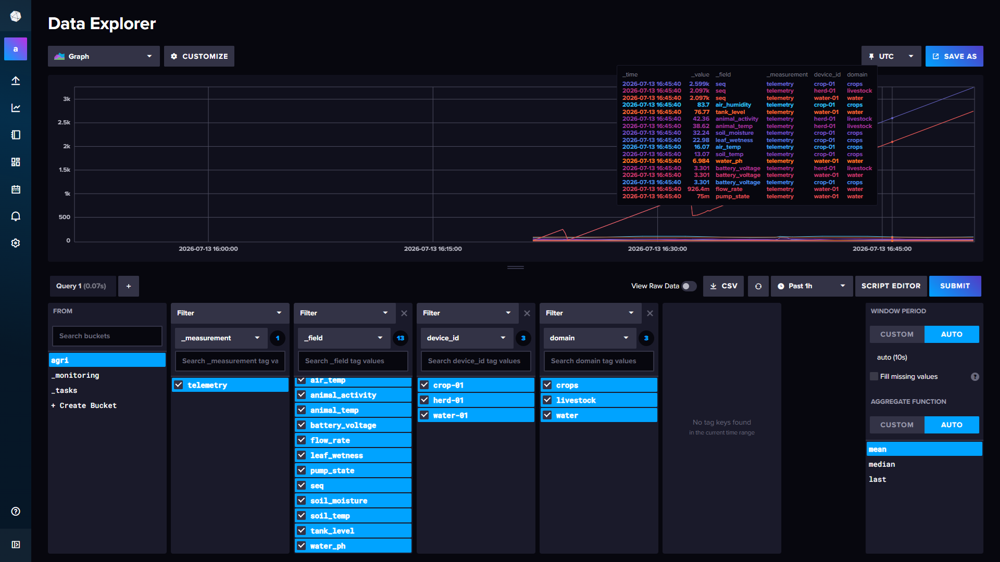

<div align="center">

# 🌾 agrisentinel

**Smart rural IoT lab — crops, water & livestock telemetry with a security layer
that treats the sensor network as an attack surface.**




</div>

Three field nodes (one per rural domain) sign every reading with HMAC and stamp
it with a sequence + nonce. A gateway verifies each frame, inspects it for
anomalies (spoofed values, replays, stale/flood traffic), and forwards only what
it trusts — publishing clean telemetry and security alerts on separate streams.
The result is two Grafana dashboards from one pipeline: an **agronomy** view and
a **SOC-style security** view.

Built **simulation-first** with a strict hexagonal architecture: a coherent
virtual farm drives the sensors, so the whole edge→broker→TSDB→dashboard path is
testable before any hardware exists. The domain and application layers are
MicroPython-safe, so the move to real ESP32 nodes is an adapter swap.

---

## Why this exists

Rural and agricultural IoT is real OT infrastructure — and it's rarely built with
security in mind. A spoofed soil sensor triggers needless irrigation; a replayed
"tank full" masks a dry tank; a compromised node floods the network. `agrisentinel`
is a teaching/portfolio lab that measures **and** defends: every frame is signed,
every reading is checked against physical reality, and every anomaly surfaces on a
dedicated security dashboard.

The design principle: **physics is the last line of defence.** Even if an attacker
steals the HMAC key, they still can't report soil moisture at 250% or an animal
temperature of 80°C without the detector flagging it. Authenticity (HMAC),
semantic integrity (plausible ranges) and freshness (anti-replay) are three
independent layers.

## Architecture



## The hexagon

The core knows nothing about MQTT, JSON, or HMAC — those live in adapters. This
is what makes the same code run in the desktop sim and on an ESP32.



## Security model

Four independent checks run on every frame at the gateway. A frame is forwarded
to the agronomy stream only if it passes the signature gate and has no critical
anomaly:



| Check | Catches | Severity |
|-------|---------|----------|
| `bad_signature` | forged / unsigned frames (wrong or missing key) | critical |
| `out_of_range` | spoofed / faulty readings outside physical limits | critical |
| `replay` | captured frames re-sent (by sequence **and** by nonce) | critical |
| `stale` | held-back / delayed replay (timestamp too old) | warning |
| `rate_anomaly` | flooding / a cloned node shouting over the real one | warning |


## Security  →  [Threat model (IEC 62443 + STRIDE)](docs/THREAT_MODEL.md)

## The two dashboards

One pipeline, two views. The **farm** dashboard is the agronomy picture; the
**security** dashboard is the SOC picture. Both refresh live off the same data.

### 🌾 Farm — every measurement across the three domains



Gauges up top (soil moisture, air temp, tank level, animal temp) and one row per
domain: crops (soil + canopy), water (tank, flow, pH) and livestock (temperature,
activity).

### 🛡 Security (SOC) — anomalies and attacks



Total & critical alert counts, a SECURE / UNDER ATTACK status, alerts stacked by
kind, max severity per node over time, and a live table of recent events. Below,
a spoof attack lighting up the SOC in real time:

<div align="center">

</div>

---

## Quick start (console, no infra)

The fastest way to see it work — no Docker needed:

```bash
pip install -e ".[dev,mqtt]"
pytest                                  # 33 passing

# a simulated day in seconds, printed to the console
python -m runner.run_sim --cycles 40 --speed 100000

# inject an attack and watch the alert fire
python -m runner.run_sim --cycles 8 --speed 100000 --attack forged --at 0
python -m runner.run_sim --cycles 8 --speed 100000 --attack spoof  --at 0
python -m runner.run_sim --cycles 8 --speed 100000 --attack replay --at 1
```

---

## Full pipeline — Docker, Node-RED, InfluxDB, Grafana

This runs the complete stack and both dashboards. ~15 minutes end to end. A
condensed, verify-as-you-go version lives in [docs/SETUP.md](docs/SETUP.md).

### 1. Build & start the containers

Mosquitto (MQTT broker), InfluxDB 2 and Grafana come up pre-provisioned:

```bash
docker compose -f deploy/docker-compose.yml up -d
docker compose -f deploy/docker-compose.yml ps      # all three "Up"
```

> Re-running later and seeing stale data or auth errors? Reset the volumes:
> `docker compose -f deploy/docker-compose.yml down -v` then `up -d`. Init
> variables only apply to an **empty** volume.

### 2. Credentials (all local-dev)

| Service | URL | User | Password | Extra |
|---------|-----|------|----------|-------|
| InfluxDB | http://localhost:8086 | `agri` | `agri-local-dev-only` | org `agri` · bucket `agri` · token `agri-local-dev-token` |
| Grafana | http://localhost:3000 | `admin` | `admin` | (skip the password-change prompt in local) |

The InfluxDB **token** `agri-local-dev-token` is what you paste into both Node-RED
and Grafana.

### 3. Node-RED — install, import, configure

Node-RED runs on the host so it can reach `localhost`:

```bash
npm install -g node-red      # first time only
node-red
```

Then at http://localhost:1880:

1. Install the InfluxDB nodes: menu ☰ → Manage palette → Install →
   `node-red-contrib-influxdb`.
2. Import the flow: menu ☰ → Import → select `deploy/nodered/flows-agri.json`.
3. Open either `influxdb out` node → edit the server config (pencil) → set
   **Token** to `agri-local-dev-token`, URL `http://localhost:8086`, org `agri`,
   version 2.0. Confirm the **Measurement** fields read `telemetry` and `alerts`.
4. **Deploy.**



The flow consumes two topics and writes two InfluxDB measurements: clean
telemetry (`agri/+/+/state` → `telemetry`) and security alerts
(`agri/security/alerts` → `alerts`).

✅ **Verify:** the two `mqtt in` nodes show *connected* underneath.

### 4. InfluxDB — confirm data lands

Once the sim is running (step 6), check the bucket directly — this isolates the
pipeline from Grafana:



Log in at http://localhost:8086, open Data Explorer → bucket `agri` → you should
see the `telemetry` and `alerts` measurements filling up.

### 5. Grafana — datasource + both dashboards

1. http://localhost:3000 → Connections → Data sources → Add → **InfluxDB**.
2. Query language **Flux**; URL `http://influxdb:8086` (Docker network name);
   org `agri`, token `agri-local-dev-token`, default bucket `agri`. Save & test.
3. Dashboards → New → Import → upload `deploy/grafana/dashboard-farm.json`, pick
   the datasource, Import. Repeat with `deploy/grafana/dashboard-security.json`.

### 6. Run the simulator

```bash
# a day in ~12 min, publishing to MQTT
python -m runner.run_sim --mqtt localhost --speed 120

# same, with an attack injected 2 virtual minutes in
python -m runner.run_sim --mqtt localhost --speed 120 --attack spoof --at 2
```

✅ **Verify:** the **Farm** dashboard (range "Last 30 minutes") fills within
seconds; launch an attack and the **Security** dashboard flips to UNDER ATTACK.

> **Order matters:** containers → Node-RED (connected) → Grafana → Python. If a
> panel says "No data", widen the range to "Last 1 hour" and confirm the sim is
> still publishing — panels show the latest value and need fresh data.

---

## Attack playground

| Flag | Simulates | Alert raised |
|------|-----------|--------------|
| `--attack spoof` | compromised soil probe reports 250% moisture | `out_of_range` (critical) |
| `--attack forged` | a frame signed with the wrong key | `bad_signature` (critical) |
| `--attack replay` | an old valid frame re-sent | `replay` (critical) |
| `--attack fever` | a **real** livestock anomaly (not an attack) | animal temp climbs on the farm view |

`--at <minutes>` controls when the attack fires in virtual time.

## Layout

```
lab/
  domain/          frames, plausible ranges, security alerts (pure, MicroPython-safe)
  application/     collect+sign (node) · verify+detect (gateway)
  adapters/
    sim/           coherent rural world + crop/water/livestock sensors
    security/      HMAC signer & verifier · anomaly detector
    codec/         JSON wire format (+ signed envelope)
    transport/     MQTT
    hw/            ESP32 adapter stubs + WIRING.md
gateway/           verify → detect → forward|alert
runner/            multi-node sim + attack injection
deploy/            docker-compose, mosquitto, Node-RED flow, 2 Grafana dashboards
tests/             33 tests incl. architecture fitness + attack scenarios
```

## Roadmap — from sim to real sensors

The whole project is built so the jump to hardware is mechanical: implement each
`Hw*` adapter, flip one import in the composition root, and the domain,
application and security layers stay untouched. Pinouts and drivers per node are
in [`WIRING.md`](lab/adapters/hw/WIRING.md).

**Phase 1 — real sensors (one node per domain):**
- [ ] `HwSoilProbe` — capacitive soil moisture (ADC) + DS18B20 soil temp (1-Wire)
- [ ] `HwCanopy` — BME280 (air temp/humidity/pressure, I2C) + leaf-wetness grid
- [ ] `HwWaterTank` — HC-SR04 level + YF-S201 flow + analog pH probe
- [ ] `HwLivestockCollar` — MLX90614 IR body temp + MPU6050 activity (I2C)
- [ ] `binary_codec.py` implementing `CodecPort` for the LoRa-friendly nodes

**Phase 2 — transport security:**
- [ ] MQTT over TLS (8883); then client certs (mTLS) so each node is individually
      revocable — the real access boundary for field IoT
- [ ] InfluxDB & Grafana behind a TLS reverse proxy; rotate the dev token to
      scoped, least-privilege, per-writer tokens

**Phase 3 — defence in depth:**
- [ ] Per-node HMAC keys (the keyring already supports `key_id` rotation/revocation)
- [ ] Tamper-evident audit log of security events (hash-chain, like `aegis-zero-trust`)
- [ ] A CI check enforcing "no raw bytes ever enter a frame" as an invariant
- [ ] Node health panel + per-node Grafana variable for a multi-node fleet

The signing layer is already identical on hardware — only the sensor reads change.

## License

MIT © 2026 Zoel Manchón — see [LICENSE](LICENSE).
