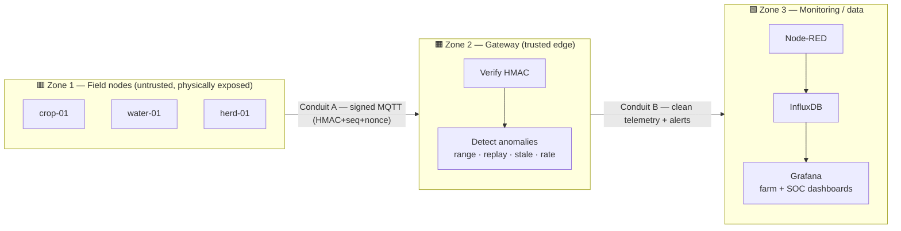

# 🛡️ Threat Model — agrisentinel

A structured security analysis of the agrisentinel rural IoT lab, framed with
**IEC 62443** concepts (zones, conduits, security levels) and **STRIDE** threat
categories. The goal: state explicitly what can go wrong, which control answers
it, and where the honest gaps are.

> Scope: the simulation-first pipeline (field nodes → gateway → monitoring).
> The same model applies once the simulated adapters are swapped for real
> ESP32 + LoRa hardware, since the domain/application core is unchanged.

---

## 1. Zones & conduits (IEC 62443)

Assets are grouped into **zones** by trust level; the **conduits** between them
are the channels that carry the risk.

| Zone | Assets | Trust | Rationale |
|------|--------|:-----:|-----------|
| **Z1 — Field nodes** | crop-01, water-01, herd-01 | Low | Physically reachable, cheap MCUs, key may be extractable |
| **Z2 — Gateway** | HMAC verifier, anomaly detector | High | The single point that decides what is trusted |
| **Z3 — Monitoring** | Node-RED, InfluxDB, Grafana | Medium | Operator-facing; needs access control, not field-exposed |

| Conduit | Carries | Protection today |
|---------|---------|------------------|
| **A** — `agri/<domain>/<node>/secure` | Raw signed readings | HMAC + sequence + nonce |
| **B** — `agri/<domain>/<node>/state` + `agri/security/alerts` | Verified telemetry, alerts | Zone separation (clean vs. alert streams) |

---

## 2. Assets & what we protect

- **Telemetry integrity** — a reading must reflect physical reality (irrigation,
  alarms and decisions depend on it).
- **Frame authenticity** — only legitimate nodes may publish.
- **Freshness** — an old "tank full" must not mask a current dry tank.
- **Availability** — a flooded broker must not blind the farm.
- **Gateway trust** — the gateway is the crown jewel; its compromise breaks the model.

---

## 3. Threat model (STRIDE per conduit / zone)

Conduit **A** (field node → gateway) is the primary attack surface.

| # | Threat (STRIDE) | Scenario | Control today | Status |
|---|-----------------|----------|---------------|:------:|
| T1 | **S**poofing | Rogue node injects fake `crop-01` frames | HMAC per-node key | ✅ mitigated |
| T2 | **T**ampering (bit-level) | MITM alters a value in transit | HMAC over payload | ✅ mitigated |
| T3 | **T**ampering (semantic) | Valid key reports soil moisture 250% | Plausible-range check ("physics") | ✅ mitigated |
| T4 | **R**eplay | Re-send a captured "tank full" frame | Sequence + nonce (anti-replay) | ✅ mitigated |
| T5 | **D**oS | Node floods broker with frames | Rate / flood detector | ⚠️ partial (detected, not rate-limited upstream) |
| T6 | **I**nfo disclosure | Sniff plaintext payloads on the wire | — (HMAC signs, does not encrypt) | ❌ **gap** |
| T7 | **S**taleness | Node goes silent, last value looks "fresh" | Stale-traffic detector | ✅ mitigated |
| T8 | Physical capture | Node stolen → HMAC key extracted | Physics layer still flags implausible data | ⚠️ residual (see §5) |
| T9 | Gateway compromise | Attacker owns the gateway | — (trusted by design) | ⚠️ residual |
| T10 | **E**levation / dashboard access | Unauthorized Grafana access | Deployment-dependent auth | ⚠️ to harden |

---

## 4. Mapping to IEC 62443 Foundational Requirements

The standard groups controls into 7 **Foundational Requirements (FR)**. Here is
where agrisentinel lands, honestly:

| FR | Foundational Requirement | Coverage | Evidence / gap |
|----|--------------------------|:--------:|----------------|
| **FR1** | Identification & Authentication Control | ✅ | Per-node HMAC keys authenticate every frame |
| **FR2** | Use Control | ➖ | No per-user roles at field level (n/a for nodes) |
| **FR3** | System Integrity | ✅✅ | HMAC (cryptographic) + plausible-range (semantic) integrity |
| **FR4** | Data Confidentiality | ❌ | **Payloads are not encrypted** — signing ≠ confidentiality |
| **FR5** | Restricted Data Flow | ✅ | Zone/conduit separation; clean vs. alert streams isolated |
| **FR6** | Timely Response to Events | ✅✅ | Anomaly detection → dedicated SOC dashboard (real-time) |
| **FR7** | Resource Availability | ⚠️ | Flood/rate detection; no upstream throttling yet |

**Target vs. achieved.** A realistic **target Security Level for Conduit A is SL 2**
(defend against an intentional attacker with low resources and generic skills).
Achieved today: SL 2 for integrity/authenticity/freshness (FR1, FR3), **below
target for confidentiality (FR4)**.

---

## 5. Residual risks & roadmap

- **FR4 — Confidentiality (highest-value next step).** Add payload encryption on
  Conduit A (e.g., AES-GCM / ChaCha20-Poly1305, or MQTT-over-TLS) so a passive
  sniffer learns nothing. This raises the conduit toward SL 3 on FR4.
- **T8 — Key extraction.** Move HMAC keys to per-node secure storage; rotate keys;
  keep the physics layer as the compensating control (defence in depth).
- **T9 — Gateway hardening.** Run the gateway on a hardened, minimal host
  (e.g., an [Emberwall](https://github.com/Zoel-Manchon/emberwall) appliance) with
  a default-deny firewall and no interactive login.
- **T10 — Monitoring access.** Enforce Grafana authentication + TLS; restrict the
  monitoring zone to operators only.
- **FR7 — Availability.** Add upstream rate-limiting / per-node quotas at the broker.

---

## 6. Design principle

**Three independent layers, so no single failure is fatal:** authenticity (HMAC),
semantic integrity (plausible ranges), and freshness (anti-replay). Even a stolen
key cannot report an animal temperature of 80 °C without the detector firing —
*physics is the last line of defence.*

---

Threat model authored for agrisentinel · framed with IEC 62443 (zones/conduits, FRs, SL) and STRIDE.

