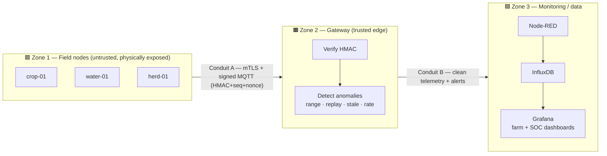

# 🛡️ Threat Model — agrisentinel

A structured security analysis of the agrisentinel rural IoT lab, framed with
**IEC 62443** concepts (zones, conduits, security levels) and **STRIDE** threat
categories. The goal: state explicitly what can go wrong, which control answers
it, and where the honest gaps are.

> Scope: the pipeline (field nodes → gateway → monitoring). The same model applies
> once simulated adapters are swapped for real ESP32 + LoRa hardware, since the
> domain/application core is unchanged.
>
> **Status:** Phase 2 (transport security) implemented — MQTT is now mutual-TLS
> only, closing the FR4 / T6 confidentiality gap. See §7 changelog.

---

## 1. Zones & conduits (IEC 62443)

Assets are grouped into **zones** by trust level; the **conduits** between them
are the channels that carry the risk.

| Zone | Assets | Trust | Rationale |
|------|--------|:-----:|-----------|
| **Z1 — Field nodes** | crop-01, water-01, herd-01 | Low | Physically reachable, cheap MCUs, key may be extractable |
| **Z2 — Gateway** | HMAC verifier, anomaly detector | High | The single point that decides what is trusted |
| **Z3 — Monitoring** | Node-RED, InfluxDB, Grafana | Medium | Operator-facing; TLS + scoped tokens |

| Conduit | Carries | Protection today |
|---------|---------|------------------|
| **A** — `agri/<domain>/<node>/secure` | Raw signed readings | **mutual TLS (8883)** + HMAC + sequence + nonce |
| **B** — `agri/<domain>/<node>/state` + `agri/security/alerts` | Verified telemetry, alerts | Zone separation (clean vs. alert streams) |

---

## 2. Assets & what we protect

- **Telemetry integrity** — a reading must reflect physical reality.
- **Frame authenticity** — only legitimate nodes may publish.
- **Confidentiality** — payloads must not be readable on the wire.
- **Freshness** — an old "tank full" must not mask a current dry tank.
- **Availability** — a flooded broker must not blind the farm.
- **Gateway trust** — the gateway is the crown jewel; its compromise breaks the model.

---

## 3. Threat model (STRIDE per conduit / zone)

Conduit **A** (field node → gateway) is the primary attack surface.

| # | Threat (STRIDE) | Scenario | Control today | Status |
|---|-----------------|----------|---------------|:------:|
| T1 | **S**poofing | Rogue node injects fake `crop-01` frames | mTLS client cert **+** HMAC key | ✅ mitigated |
| T2 | **T**ampering (bit-level) | MITM alters a value in transit | TLS channel **+** HMAC over payload | ✅ mitigated |
| T3 | **T**ampering (semantic) | Valid key reports soil moisture 250% | Plausible-range check ("physics") | ✅ mitigated |
| T4 | **R**eplay | Re-send a captured "tank full" frame | Sequence + nonce (anti-replay) | ✅ mitigated |
| T5 | **D**oS | Node floods broker with frames | Rate / flood detector | ⚠️ partial (detected, not rate-limited upstream) |
| T6 | **I**nfo disclosure | Sniff plaintext payloads on the wire | **mTLS encrypts the channel** | ✅ mitigated *(Phase 2)* |
| T7 | **S**taleness | Node goes silent, last value looks "fresh" | Stale-traffic detector | ✅ mitigated |
| T8 | Physical capture | Node stolen → key/cert extracted | Physics layer flags implausible data; cert revocable via CRL | ⚠️ residual (see §5) |
| T9 | Gateway compromise | Attacker owns the gateway | — (trusted by design) | ⚠️ residual |
| T10 | **E**levation / dashboard access | Unauthorized Grafana access | TLS proxy (Caddy) + admin auth | ⚠️ hardening in progress |

---

## 4. Mapping to IEC 62443 Foundational Requirements

| FR | Foundational Requirement | Coverage | Evidence / gap |
|----|--------------------------|:--------:|----------------|
| **FR1** | Identification & Authentication Control | ✅✅ | Per-node **mTLS certificates** (CN = node-id = key_id) **+** HMAC keys |
| **FR2** | Use Control | ➖ | No per-user roles at field level (n/a for nodes) |
| **FR3** | System Integrity | ✅✅ | HMAC (cryptographic) + plausible-range (semantic) integrity |
| **FR4** | Data Confidentiality | ✅ | **MQTT over mutual TLS** — payloads encrypted end of Phase 2 |
| **FR5** | Restricted Data Flow | ✅ | Zone/conduit separation; clean vs. alert streams isolated |
| **FR6** | Timely Response to Events | ✅✅ | Anomaly detection → dedicated SOC dashboard (real-time) |
| **FR7** | Resource Availability | ⚠️ | Flood/rate detection; no upstream throttling yet |

**Target vs. achieved.** Target for **Conduit A is SL 2**, and with mTLS +
per-node certificates + HMAC + anti-replay it now meets **SL 2 across FR1/FR3/FR4**
and reaches toward **SL 3** on authenticity and confidentiality.

---

## 5. Residual risks & roadmap

- **T8 — Key/cert extraction.** Move HMAC keys + client key to per-node secure
  storage; rotate; revoke a compromised node with `revoke-node.sh` (CRL) **and**
  its `key_id` in the keyring — coordinated two-layer revocation.
- **T9 — Gateway hardening.** Run the gateway on a hardened, minimal host
  (e.g., an [Emberwall](https://github.com/Zoel-Manchon/emberwall) appliance) with
  a default-deny firewall and no interactive login.
- **T10 — Monitoring access.** InfluxDB/Grafana are now behind a TLS proxy; next:
  scoped per-writer InfluxDB tokens (retire the admin token) + Grafana SSO/roles.
- **FR7 — Availability.** Add upstream rate-limiting / per-node quotas at the broker.

---

## 6. Design principle

**Defence in depth, complementary layers:** mTLS secures the *channel*
(node ↔ broker, hop by hop); HMAC secures the *frame* end-to-end (node → gateway),
survives intermediate brokers, and carries the `key_id` the business logic needs.
On top: semantic integrity (plausible ranges) and freshness (anti-replay). Even a
stolen key cannot report an animal temperature of 80 °C without the detector firing
— *physics is the last line of defence.*

---

## 7. Changelog

- **Phase 2 — Transport security.** MQTT moved to **mutual TLS (8883)** with a
  project CA and one client certificate per node (`CN = node-id = key_id`);
  plaintext `1883` removed. Grafana & InfluxDB placed behind a TLS reverse proxy.
  → Closes **FR4 / T6**; strengthens **FR1**; adds transport-level revocation (CRL).

---

Threat model for agrisentinel · IEC 62443 (zones/conduits, FRs, SL) + STRIDE.

